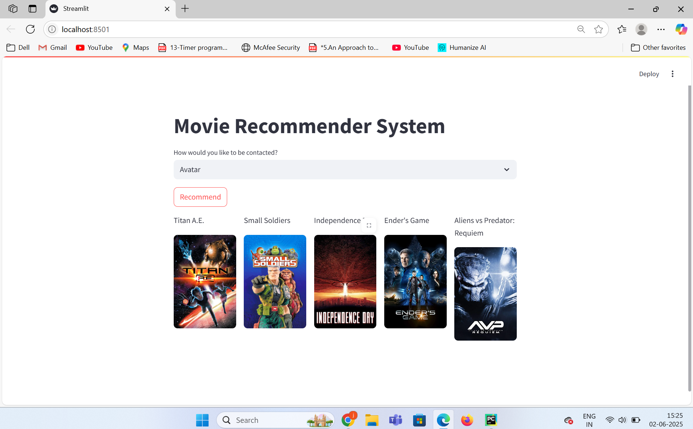
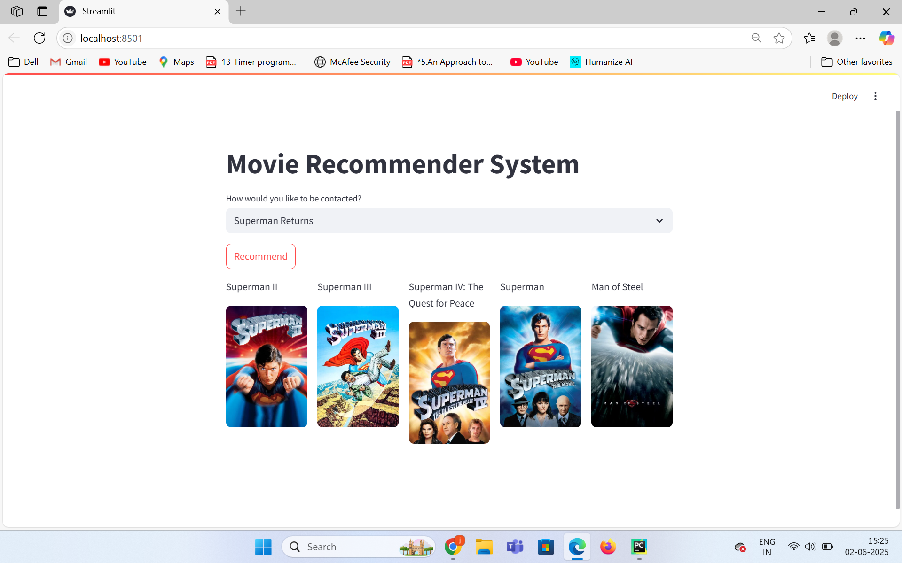
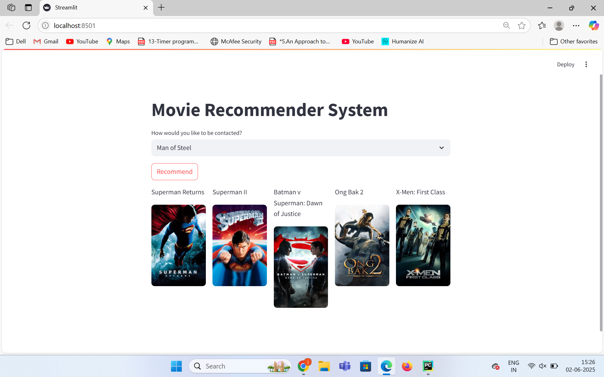

title: "🎥 Movie Recommender App"
output: github_document

# 🎥 Movie Recommender App

A **full-stack movie recommendation platform** powered by `Streamlit`, `TMDB API`, and **content-based filtering** using **cosine similarity**.

## ✨ Features

- 🔍 Movie Selection Dropdown  
- 🎯 Top 5 Content-Based Recommendations  
- 🖼️ Poster Display Using TMDB API  
- ⚡ Fast Response Time (precomputed similarity matrix)  
- 📦 Pickled Dataset Integration  
- 🚀 Deployable via **Vercel** (Frontend) and **Render** (Backend for TMDB Proxy)

## 🧪 Tech Stack

| Frontend        | Backend           | ML/Tools        |
|----------------|-------------------|-----------------|
| Streamlit      | TMDB API (REST)   | Cosine Similarity |
| HTML/CSS (auto)| Python + Requests | Scikit-learn     |
| Vercel         | API Key Injection | Pandas, NumPy    |

## 📂 Folder Structure

📁 movie-recommender/
The main project directory that contains all source code, data, and configurations for your Movie Recommender App.

├── app.py
Streamlit app logic
Contains the frontend code, movie selection interface, recommendation logic, TMDB API integration, and poster rendering.

├── movie_dict.pkl
Serialized movie dataset
A pickled pandas.DataFrame containing metadata for each movie such as title, id, genres, etc.

├── similarity.pkl
Cosine similarity matrix
A pickled 2D array of similarity scores used to recommend the top 5 most similar movies to a given movie.

├── .streamlit/
Streamlit deployment config directory
Contains configuration files for Streamlit when deployed to the cloud.

└── config.toml
Streamlit deployment configuration
Tells Streamlit how to run the server in a cloud or headless environment (used by platforms like Vercel or Render).

├── requirements.txt
Python dependencies
List of required Python packages. You can install them using:

pip install -r requirements.txt
└── README.Rmd
RMarkdown project documentation
Formatted documentation describing the project, features, setup, and deployment instructions — ideal for GitHub or academic use.

⚙️ Local Setup
1. Install Requirements --> pip install -r requirements.txt
2. Run the App Locally --> streamlit run app.py

## 🌐 Deployment Instructions

### 🔹 Frontend: Streamlit Cloud or Vercel

```bash
mkdir -p ~/.streamlit/

echo "\
[server]\n\
port = \$PORT\n\
enableCORS = false\n\
headless = true\n\
" > ~/.streamlit/config.toml
💾 Backend Data
movie_dict.pkl
Contains a pickled pandas.DataFrame of movie metadata (title, id, etc.).

similarity.pkl
Stores a precomputed cosine similarity matrix (2D array of similarity scores between movies).

These files are derived from the TMDB 5000 Movie Dataset (movies and credits) and processed using a Jupyter Notebook pipeline.
## Screenshots

### 🔍 Avatar


### 🎯 Recommendation Output


### 🎯 Man of Steel

